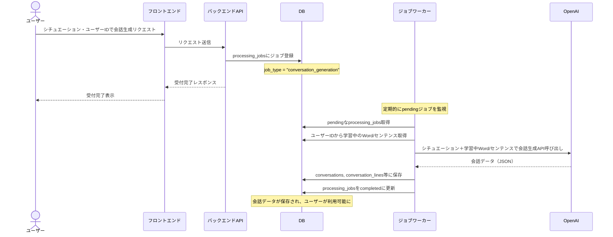
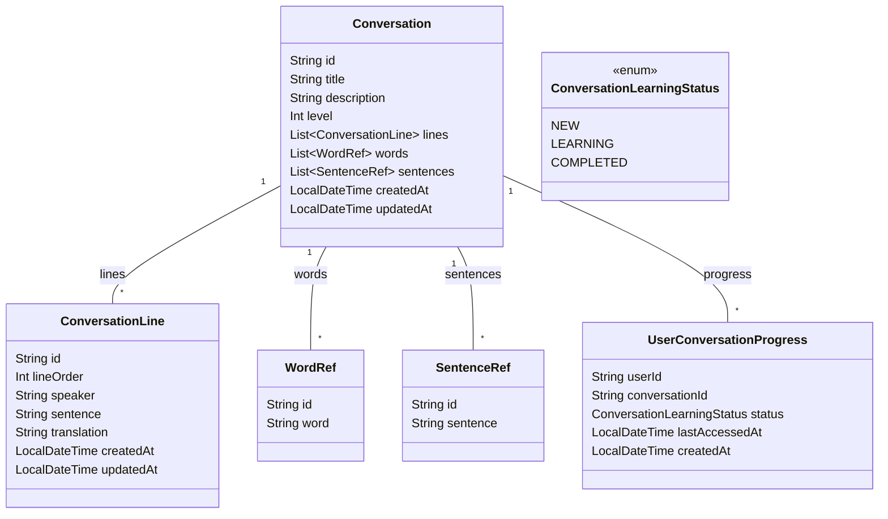

# 会話コンテンツ設計ドキュメント

## 概要

本ドキュメントは、学習中のWordやセンテンスを活用した会話コンテンツの設計（テーブル構造、API、画面UI）についてまとめます。

---

## テーブル設計

### 1. conversations（会話コンテンツ）

| カラム名         | 型            | 説明                |
|------------------|---------------|---------------------|
| id               | VARCHAR(36)   | PK                  |
| title            | VARCHAR(255)  | 会話タイトル        |
| description      | TEXT          | 会話の説明          |
| level            | INT           | 難易度              |
| created_at       | TIMESTAMP     | 作成日時            |
| updated_at       | TIMESTAMP     | 更新日時            |

### 2. conversation_lines（会話のセリフ）

| カラム名           | 型            | 説明                |
|--------------------|---------------|---------------------|
| id                 | VARCHAR(36)   | PK                  |
| conversation_id    | VARCHAR(36)   | conversations FK    |
| line_order         | INT           | セリフ順            |
| speaker            | VARCHAR(50)   | 話者                |
| sentence           | TEXT          | 英文                |
| translation        | TEXT          | 日本語訳            |
| created_at         | TIMESTAMP     | 作成日時            |
| updated_at         | TIMESTAMP     | 更新日時            |

### 3. conversation_line_words（セリフとWordの関連）

| カラム名           | 型            | 説明                |
|--------------------|---------------|---------------------|
| id                 | VARCHAR(36)   | PK                  |
| conversation_line_id | VARCHAR(36) | conversation_lines FK|
| word_id            | VARCHAR(36)   | words FK            |
| created_at         | TIMESTAMP     | 作成日時            |

### 4. conversation_line_sentences（セリフとセンテンスの関連）

| カラム名           | 型            | 説明                |
|--------------------|---------------|---------------------|
| id                 | VARCHAR(36)   | PK                  |
| conversation_line_id | VARCHAR(36) | conversation_lines FK|
| sentence_id        | VARCHAR(36)   | sentences FK        |
| created_at         | TIMESTAMP     | 作成日時            |

### 5. user_conversations（会話コンテンツとUserの関連）

| カラム名           | 型            | 説明                |
|--------------------|---------------|---------------------|
| id                 | VARCHAR(36)   | PK                  |
| user_id            | VARCHAR(36)   | users FK            |
| conversation_id    | VARCHAR(36)   | conversations FK    |
| status             | ENUM('new','learning','completed') | 学習状況 |
| last_accessed_at   | TIMESTAMP     | 最終アクセス日時    |
| created_at         | TIMESTAMP     | 作成日時            |

---

## API設計

### 会話コンテンツ一覧取得
- GET `/api/conversations`
- レスポンス例:
```json
[
  {
    "id": "uuid",
    "title": "At the Restaurant",
    "description": "レストランでの会話",
    "level": 2
  }
]
```

### 会話コンテンツ詳細取得
- GET `/api/conversations/{id}`
- レスポンス例:
```json
{
  "id": "uuid",
  "title": "At the Restaurant",
  "description": "レストランでの会話",
  "level": 2,
  "lines": [
    {
      "id": "line-uuid",
      "lineOrder": 1,
      "speaker": "Waiter",
      "sentence": "May I take your order?",
      "translation": "ご注文をお伺いしますか？",
      "words": [
        { "id": "word-uuid", "word": "order" }
      ],
      "sentences": [
        { "id": "sentence-uuid", "sentence": "May I take your order?" }
      ]
    }
  ]
}
```

### ユーザーの会話学習状況取得
- GET `/api/user/conversations`
- レスポンス例:
```json
[
  {
    "conversationId": "uuid",
    "status": "learning",
    "lastAccessedAt": "2024-06-01T12:00:00Z"
  }
]
```

### 会話学習状況更新
- PUT `/api/user/conversations/{conversationId}`
- リクエスト例:
```json
{
  "status": "completed"
}
```

---

## 画面設計（ワイヤーフレーム案）

### 1. 会話コンテンツ一覧画面
- 会話タイトル、レベル、説明をリスト表示
- 各会話をクリックで詳細画面へ遷移

### 2. 会話詳細・学習画面
- 会話タイトル、説明、レベル表示
- セリフごとに話者・英文・和訳・重要Word・センテンスを表示
- セリフごとに「再生」「自分で発音」「単語詳細」などのアクション
- 進捗バーや「学習完了」ボタン

### 3. ユーザーの学習進捗画面
- 学習中・完了済みの会話コンテンツを一覧表示
- 最終アクセス日時や進捗率を表示

---

## 備考
- WordやSentenceのテーブルは既存設計を流用
- 会話コンテンツはWord/Sentenceと多対多で関連付け
- ユーザーごとに学習進捗を管理

---

## 会話自動生成フロー（シーケンス図）



---

### 補足
- ジョブワーカーは、ジョブのpayloadに含まれるユーザーIDを元に、user_words・user_sentences等から「学習中」のWord/センテンスをDBから取得します。
- 取得したWord/センテンスと、リクエストされたシチュエーションを組み合わせてOpenAI APIに投げることで、ユーザーの学習内容に最適化された会話が生成されます。
- OpenAIへのプロンプト例：
  - 「以下の単語と例文を必ず使い、シチュエーション『レストラン』で簡単な英会話を作成してください。単語: apple, book ... 例文: How are you? ...」

---

## アドバイス
- OpenAI APIのレスポンスが不適切な場合やエラー時のリトライ・エラーハンドリングを必ず実装してください。
- 会話生成ジョブのpayloadには、ユーザーID・シチュエーション・希望レベル等を含めると柔軟性が高まります。
- 生成された会話データは、必ずバリデーション（例：セリフ数、空文字チェック等）を行い、品質を担保してください。
- ジョブの進捗やエラーはユーザーに通知できる仕組みがあるとUXが向上します。
- 会話生成のOpenAIプロンプトは、用途に応じてテンプレート化・バージョン管理すると運用が楽です。

## クラス設計（集約ルート: Conversation）

会話コンテンツは `Conversation` を集約ルートとし、関連するセリフや単語・センテンスとの関連も含めて一括で取得・保存できる形で設計します。

```kotlin
// Conversation集約のドメインモデル例

data class Conversation(
    val id: String,
    val title: String,
    val description: String?,
    val level: Int,
    val lines: List<ConversationLine>,
    val words: List<WordRef>,        // 追加: 会話全体で使われる単語リスト
    val sentences: List<SentenceRef>,// 追加: 会話全体で使われる例文リスト
    val createdAt: LocalDateTime,
    val updatedAt: LocalDateTime
)

data class ConversationLine(
    val id: String,
    var lineOrder: Int,
    val speaker: String?,
    var sentence: String,
    var translation: String,
    val createdAt: LocalDateTime,
    val updatedAt: LocalDateTime
)

data class WordRef(
    val id: String,
    val word: String
)

data class SentenceRef(
    val id: String,
    val sentence: String
)

// ユーザー進捗も集約で扱う場合

data class UserConversationProgress(
    val userId: String,
    val conversationId: String,
    val status: ConversationLearningStatus, // NEW, LEARNING, COMPLETED
    val lastAccessedAt: LocalDateTime?,
    val createdAt: LocalDateTime
)

enum class ConversationLearningStatus { NEW, LEARNING, COMPLETED }
```

### 集約の特徴
- Conversationを起点に、lines（セリフ）、words/sentences（会話全体で使われる単語・例文）を一括で管理
- Conversation単位で取得・保存・更新が可能
- APIやサービス層ではこの集約モデルをやり取りすることで、永続化や取得がシンプルになる
- 進捗管理もUserConversationProgressとして集約に含めることで、ユーザーごとの状態も一元管理できる

## クラス図（Conversation集約）

