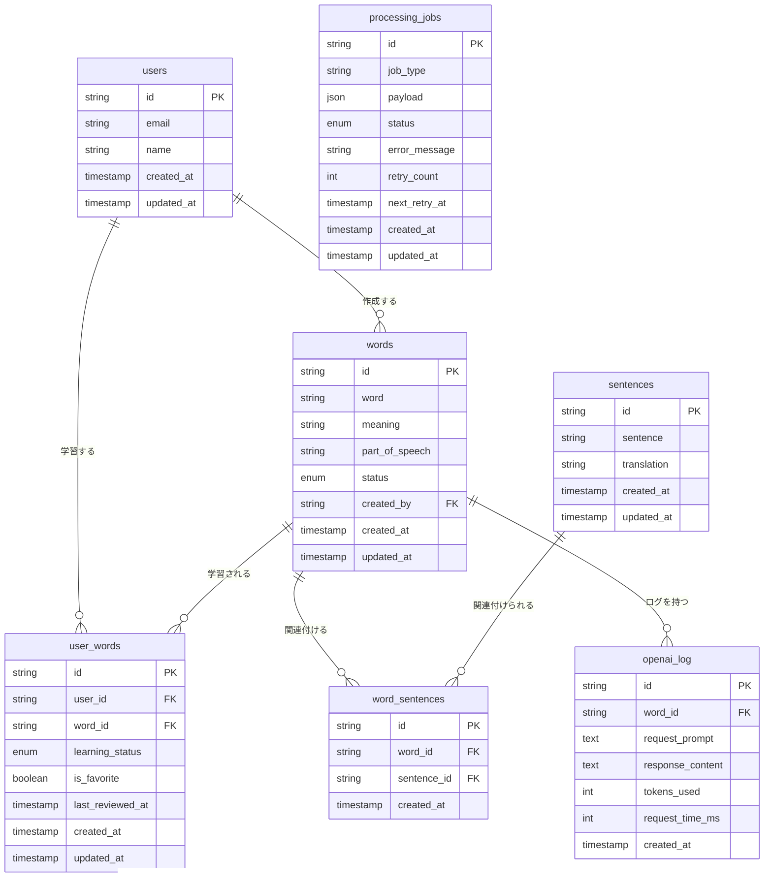

# 英語学習システム設計ドキュメント

## 概要

このシステムは、ユーザーが英単語を登録し、OpenAIのAPIを使用して翻訳、品詞の特定、例文の作成を自動化する英語学習サポートシステムです。ユーザー間で単語を共有でき、個々のユーザーごとに学習状況を管理できます。

## テーブル構造

### users テーブル

ユーザー情報を管理します。

```sql
CREATE TABLE users (
  id VARCHAR(36) PRIMARY KEY,
  email VARCHAR(255) NOT NULL UNIQUE,
  name VARCHAR(255) NOT NULL,
  created_at TIMESTAMP DEFAULT CURRENT_TIMESTAMP,
  updated_at TIMESTAMP DEFAULT CURRENT_TIMESTAMP ON UPDATE CURRENT_TIMESTAMP
);
```

### words テーブル

登録された英単語を管理します。ユーザー間で共有可能です。

```sql
CREATE TABLE words (
  id VARCHAR(36) PRIMARY KEY,
  word VARCHAR(255) NOT NULL UNIQUE,
  meaning VARCHAR(255) NOT NULL,
  part_of_speech VARCHAR(50) NOT NULL,
  status ENUM('pending', 'processing', 'completed', 'error') DEFAULT 'pending',
  created_by VARCHAR(36),
  created_at TIMESTAMP DEFAULT CURRENT_TIMESTAMP,
  updated_at TIMESTAMP DEFAULT CURRENT_TIMESTAMP ON UPDATE CURRENT_TIMESTAMP,
  FOREIGN KEY (created_by) REFERENCES users(id) ON DELETE SET NULL
);
```

### user_words テーブル

ユーザーと単語の関連付けを管理します。学習状況やお気に入り登録などのユーザー固有の情報を記録します。

```sql
CREATE TABLE user_words (
  id VARCHAR(36) PRIMARY KEY,
  user_id VARCHAR(36) NOT NULL,
  word_id VARCHAR(36) NOT NULL,
  learning_status ENUM('new', 'learning', 'mastered') DEFAULT 'new',
  is_favorite BOOLEAN DEFAULT FALSE,
  last_reviewed_at TIMESTAMP,
  created_at TIMESTAMP DEFAULT CURRENT_TIMESTAMP,
  updated_at TIMESTAMP DEFAULT CURRENT_TIMESTAMP ON UPDATE CURRENT_TIMESTAMP,
  FOREIGN KEY (user_id) REFERENCES users(id) ON DELETE CASCADE,
  FOREIGN KEY (word_id) REFERENCES words(id) ON DELETE CASCADE,
  UNIQUE INDEX (user_id, word_id)
);
```

### sentences テーブル

例文を管理します。複数の単語で同じ例文を共有できます。

```sql
CREATE TABLE sentences (
  id VARCHAR(36) PRIMARY KEY,
  sentence TEXT NOT NULL,
  translation TEXT NOT NULL,
  created_at TIMESTAMP DEFAULT CURRENT_TIMESTAMP,
  updated_at TIMESTAMP DEFAULT CURRENT_TIMESTAMP ON UPDATE CURRENT_TIMESTAMP
);
```

### word_sentences テーブル

単語と例文の多対多の関連付けを管理します。

```sql
CREATE TABLE word_sentences (
  id VARCHAR(36) PRIMARY KEY,
  word_id VARCHAR(36) NOT NULL,
  sentence_id VARCHAR(36) NOT NULL,
  created_at TIMESTAMP DEFAULT CURRENT_TIMESTAMP,
  FOREIGN KEY (word_id) REFERENCES words(id) ON DELETE CASCADE,
  FOREIGN KEY (sentence_id) REFERENCES sentences(id) ON DELETE CASCADE,
  UNIQUE INDEX (word_id, sentence_id)
);
```

### processing_jobs テーブル

様々な非同期処理ジョブを管理する汎用的なジョブキューです。

```sql
CREATE TABLE processing_jobs (
  id VARCHAR(36) PRIMARY KEY,
  job_type VARCHAR(50) NOT NULL,
  payload JSON NOT NULL,
  status ENUM('pending', 'processing', 'completed', 'error') DEFAULT 'pending',
  error_message TEXT,
  retry_count INT DEFAULT 0,
  next_retry_at TIMESTAMP,
  created_at TIMESTAMP DEFAULT CURRENT_TIMESTAMP,
  updated_at TIMESTAMP DEFAULT CURRENT_TIMESTAMP ON UPDATE CURRENT_TIMESTAMP,
  INDEX (job_type, status),
  INDEX (next_retry_at)
);
```

### openai_log テーブル

OpenAI APIのリクエストとレスポンスを記録します。

```sql
CREATE TABLE openai_log (
  id VARCHAR(36) PRIMARY KEY,
  word_id VARCHAR(36) NOT NULL,
  request_prompt TEXT NOT NULL,
  response_content TEXT NOT NULL,
  tokens_used INT,
  request_time_ms INT,
  created_at TIMESTAMP DEFAULT CURRENT_TIMESTAMP,
  FOREIGN KEY (word_id) REFERENCES words(id) ON DELETE CASCADE
);
```

## ER図



## 処理フロー


## 詳細処理フロー

### 1. 単語登録フロー

1. ユーザーがフロントエンドで英単語を入力して登録ボタンをクリック
2. フロントエンドがバックエンドAPIに単語を送信
3. バックエンドが以下の処理を実行:
   - 単語が既に存在するか確認
   - 存在しない場合:
     - `words`テーブルに単語を登録（ステータス：pending）
     - 単語処理ジョブを作成:
       ```json
       {
         "job_type": "word_processing",
         "payload": {
           "word_id": "uuid",
           "word": "example",
           "created_by": "user-uuid"
         }
       }
       ```
   - いずれの場合も:
     - `user_words`テーブルにユーザーと単語の関連付けを登録
4. フロントエンドに成功レスポンスを返す
5. フロントエンドがユーザーに登録完了を表示

## ジョブタイプ例

### 単語処理ジョブ (word_processing)

```json
{
  "job_type": "word_processing",
  "payload": {
    "word_id": "uuid",
    "word": "example",
    "created_by": "user-uuid"
  }
}
```

### バッチ翻訳ジョブ (batch_translation)

```json
{
  "job_type": "batch_translation",
  "payload": {
    "sentence_ids": ["uuid-1", "uuid-2", "uuid-3"],
    "source_language": "en",
    "target_language": "ja"
  }
}
```

### 定期学習リマインダージョブ (learning_reminder)

```json
{
  "job_type": "learning_reminder",
  "payload": {
    "user_id": "uuid",
    "user_email": "user@example.com",
    "reminder_type": "daily_review",
    "word_count": 5
  }
}
```

### 2. バックエンド処理フロー

1. バックエンドのジョブスケジューラが3分ごとに起動
2. `processing_jobs`テーブルからステータスが'pending'で、処理時間が来ているジョブを取得（一度に処理する数に制限を設定）
3. ジョブタイプに応じて異なる処理を実行:
   
   #### 単語処理ジョブ (job_type = 'word_processing')
   - ジョブステータスを'processing'に更新
   - ペイロードからword_idを取得し、対応するワードのステータスを'processing'に更新
   - OpenAI APIを呼び出し、以下の情報を取得:
     - 翻訳（日本語）
     - 品詞
     - 例文（複数）と各例文の日本語訳
   - OpenAI APIのリクエスト内容とレスポンスを`openai_log`テーブルに保存
   - 取得した意味と品詞を`words`テーブルに保存
   - 取得した例文と訳文を処理:
     - 例文が既存かチェック
     - 存在しない場合は`sentences`テーブルに新規追加
     - `word_sentences`テーブルに単語と例文の関連付けを保存
   - 単語のステータスを'completed'に更新
   
   #### その他のジョブタイプ
   - ジョブタイプに応じた専用のハンドラを呼び出し、処理を実行
   
4. 処理が完了したら、ジョブのステータスを'completed'に更新
5. エラーが発生した場合:
   - エラーメッセージを`processing_jobs`テーブルに記録
   - リトライカウントを増やし、一定回数以下ならステータスを'pending'に戻す
   - 次回リトライ時間を設定（指数バックオフなどのリトライ戦略を適用）
   - 一定回数を超えたらステータスを'error'に設定

## API仕様

### 単語登録API

- エンドポイント: `POST /api/words`
- リクエスト:
  ```json
  {
    "word": "example"
  }
  ```
- レスポンス:
  ```json
  {
    "id": "uuid",
    "word": "example",
    "meaning": "",
    "partOfSpeech": "",
    "status": "pending",
    "learningStatus": "new",
    "isFavorite": false,
    "lastReviewedAt": null,
    "sentences": [],
    "createdAt": "2023-07-10T12:00:00Z"
  }
  ```

### 単語一覧取得API

- エンドポイント: `GET /api/words`
- クエリパラメータ:
  - `learningStatus`: フィルタ（オプション）- "new", "learning", "mastered"
  - `page`: ページ番号（オプション）
  - `limit`: 1ページあたりの件数（オプション）
- レスポンス:
  ```json
  {
    "total": 100,
    "page": 1,
    "limit": 10,
    "words": [
      {
        "id": "uuid",
        "word": "example",
        "meaning": "例",
        "partOfSpeech": "noun",
        "status": "completed",
        "learningStatus": "new",
        "isFavorite": false,
        "lastReviewedAt": null,
        "sentences": [
          {
            "id": "uuid",
            "sentence": "This is an example sentence.",
            "translation": "これは例文です。"
          },
          {
            "id": "uuid",
            "sentence": "Can you give me another example?",
            "translation": "別の例を挙げてもらえますか？"
          }
        ],
        "createdAt": "2023-07-10T12:00:00Z"
      },
      ...
    ]
  }
  ```

### 単語詳細取得API

- エンドポイント: `GET /api/words/{id}`
- レスポンス:
  ```json
  {
    "id": "uuid",
    "word": "example",
    "meaning": "例",
    "partOfSpeech": "noun",
    "status": "completed",
    "learningStatus": "new",
    "isFavorite": false,
    "lastReviewedAt": null,
    "sentences": [
      {
        "id": "uuid",
        "sentence": "This is an example sentence.",
        "translation": "これは例文です。"
      },
      {
        "id": "uuid",
        "sentence": "Can you give me another example?",
        "translation": "別の例を挙げてもらえますか？"
      }
    ],
    "createdAt": "2023-07-10T12:00:00Z",
    "updatedAt": "2023-07-10T12:05:00Z"
  }
  ```

### 学習状況更新API

- エンドポイント: `PATCH /api/words/{id}/learning-status`
- リクエスト:
  ```json
  {
    "status": "learning"
  }
  ```
- レスポンス:
  ```json
  {
    "success": true
  }
  ```

### お気に入り登録/解除API

- エンドポイント: `PATCH /api/words/{id}/favorite`
- レスポンス:
  ```json
  {
    "isFavorite": true
  }
  ```

### 例文検索API（新規）

- エンドポイント: `GET /api/sentences`
- クエリパラメータ:
  - `query`: 検索キーワード（オプション）
  - `page`: ページ番号（オプション）
  - `limit`: 1ページあたりの件数（オプション）
- レスポンス:
  ```json
  {
    "total": 150,
    "page": 1,
    "limit": 10,
    "sentences": [
      {
        "id": "uuid",
        "sentence": "This is an example sentence.",
        "translation": "これは例文です。",
        "relatedWords": [
          {
            "id": "uuid",
            "word": "example",
            "meaning": "例"
          },
          {
            "id": "uuid",
            "word": "sentence",
            "meaning": "文"
          }
        ],
        "createdAt": "2023-07-10T12:00:00Z"
      },
      ...
    ]
  }
  ```

### 例文詳細取得API（新規）

- エンドポイント: `GET /api/sentences/{id}`
- レスポンス:
  ```json
  {
    "id": "uuid",
    "sentence": "This is an example sentence.",
    "translation": "これは例文です。",
    "relatedWords": [
      {
        "id": "uuid",
        "word": "example",
        "meaning": "例",
        "partOfSpeech": "noun"
      },
      {
        "id": "uuid",
        "word": "sentence",
        "meaning": "文",
        "partOfSpeech": "noun"
      }
    ],
    "createdAt": "2023-07-10T12:00:00Z",
    "updatedAt": "2023-07-10T12:05:00Z"
  }
  ```

### ジョブ作成API（新規）

- エンドポイント: `POST /api/jobs`
- リクエスト:
  ```json
  {
    "job_type": "word_processing",
    "payload": {
      "word_id": "uuid",
      "word": "example"
    },
    "schedule_at": "2023-07-10T15:00:00Z" // オプション
  }
  ```
- レスポンス:
  ```json
  {
    "id": "uuid",
    "job_type": "word_processing",
    "status": "pending",
    "created_at": "2023-07-10T12:00:00Z",
    "next_retry_at": "2023-07-10T15:00:00Z"
  }
  ```

### ジョブ一覧取得API（新規）

- エンドポイント: `GET /api/jobs`
- クエリパラメータ:
  - `job_type`: ジョブタイプでフィルタ（オプション）
  - `status`: ステータスでフィルタ（オプション）
  - `page`: ページ番号（オプション）
  - `limit`: 1ページあたりの件数（オプション）
- レスポンス:
  ```json
  {
    "total": 100,
    "page": 1,
    "limit": 10,
    "jobs": [
      {
        "id": "uuid",
        "job_type": "word_processing",
        "payload": {
          "word_id": "uuid",
          "word": "example"
        },
        "status": "completed",
        "retry_count": 0,
        "created_at": "2023-07-10T12:00:00Z",
        "updated_at": "2023-07-10T12:05:00Z"
      },
      ...
    ]
  }
  ```

### ジョブ詳細取得API（新規）

- エンドポイント: `GET /api/jobs/{id}`
- レスポンス:
  ```json
  {
    "id": "uuid",
    "job_type": "word_processing",
    "payload": {
      "word_id": "uuid",
      "word": "example"
    },
    "status": "completed",
    "retry_count": 0,
    "error_message": null,
    "created_at": "2023-07-10T12:00:00Z",
    "updated_at": "2023-07-10T12:05:00Z",
    "next_retry_at": null
  }
  ```

### ジョブ手動リトライAPI（新規）

- エンドポイント: `POST /api/jobs/{id}/retry`
- レスポンス:
  ```json
  {
    "id": "uuid",
    "status": "pending",
    "next_retry_at": "2023-07-10T12:10:00Z"
  }
  ```

## OpenAI APIリクエスト例

```json
{
  "model": "gpt-4",
  "messages": [
    {
      "role": "system",
      "content": "あなたは英語学習アシスタントです。以下の英単語に対して、(1)日本語訳、(2)品詞、(3)例文を3つ提供してください。各例文には英文とその日本語訳を含めてください。応答は厳密にJSON形式で行ってください。"
    },
    {
      "role": "user",
      "content": "単語: example"
    }
  ],
  "response_format": { "type": "json_object" }
}
```

## OpenAI APIレスポンス例

```json
{
  "meaning": "例、実例、見本",
  "partOfSpeech": "noun",
  "sentences": [
    {
      "sentence": "This is a good example of modern architecture.",
      "translation": "これは現代建築の良い例です。"
    },
    {
      "sentence": "Could you give me an example of what you mean?",
      "translation": "あなたが言いたいことの例を挙げていただけますか？"
    },
    {
      "sentence": "She sets a good example for the younger children.",
      "translation": "彼女は幼い子供たちに良い手本を示しています。"
    }
  ]
}
``` 